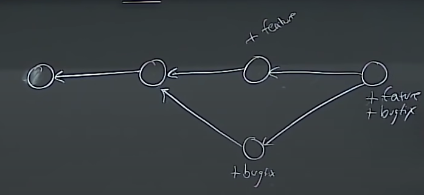

# Git and GitHub notes

* Git's interface is bad, we want to learn it bottom up not top down.

## How does git work

* Models stuff in a topdown directory system (eg. below)

* root
    * "tree" (folder)
        * blobs, or more trees... (recursive)
    * "blob" (file)
    * ...

* Directed asynchonous tree (I think that's what he said)
    * you can work on different unrelated things in separate forks, like a whole new feature, as well as bug fix, then merge

    * Merge conflicts can arise, and git has tools for resolving these
    * In each node of the above graph ("snapshot") there is metadata like author, time, etc.

* pseudocode for data structure of git:
    ```
    type blob = array<byte>
    type tree = map<string, tree | blob>
    typr commit = struct {
        parents: array<commit>
        author: string
        message: string
        snapshot: tree
    }
    type object = blob | tree | commit
    objects = map<string, object>

    def store(0)
        id = shal(0)
        objects[id] = 0

    def load(id)
        return object[id]

    # can give human-readable names called references instead of hexadecimal strings 
    # references are mutable, doesn't change the hash or the graph when you change the name

    references = map<string, string> 
    ```
    
* "staging area"
    * need to use git add in order to put things in the staging area, so they're ready to be committed
* you should write high quality commit messages when prompted
* git log shows graph
* master is a pointer to the first commit, moves as you add more main commits
* git checkout lets you move around in your version history
    * changes your working copy to other spot in commit history
    * "git checkout commit_hash_or_name"
    * CARFEUL, it can throw out your changes
* git diff
    * what changed since head, or if you include hash after diff it'll compare with that specific copy


* the repository is .git
* git remote is how you see other copies of the repository (like those on github)
    * git remote add origin link_or_path_to_repo
* git push \<remote> \<local branch>:\<remote branch>
    * puts stuff up to other repo (I think?)

* git clone (take from online) (works like mv)
* git remote, git push, git fetch, git merge, git clone are the important ones
* git add -p 
    * interactive staging: lets you not add print statements you used to test, for example
* git stash
    * hide the change you just made for a bit I guess
* git bisect
    * see how long ago your unit test stopped working
* .gitignore file will ignore certain types of files (like executables, since you only want to commit source code probably)


* honestly he said a ton of stuff I'll just look at the lecture notes later